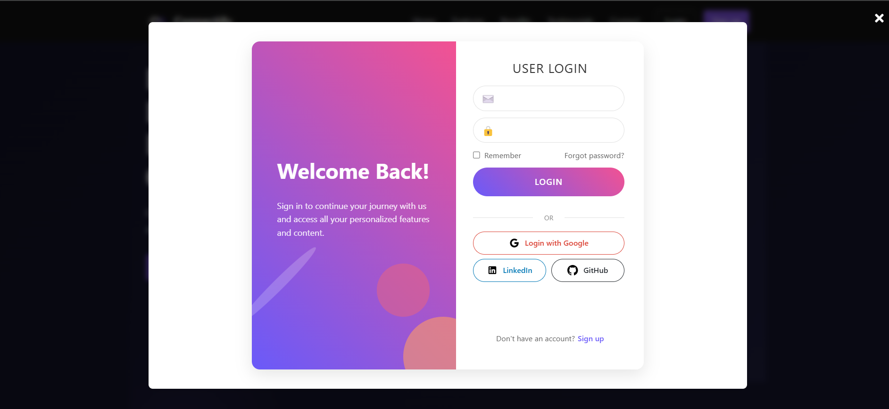
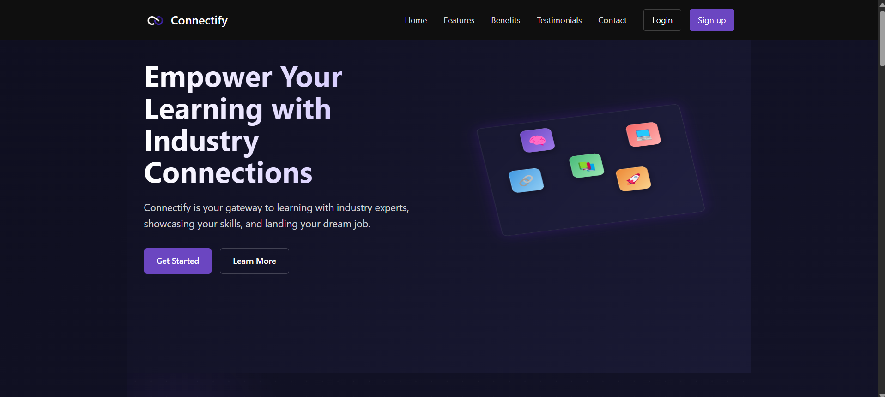
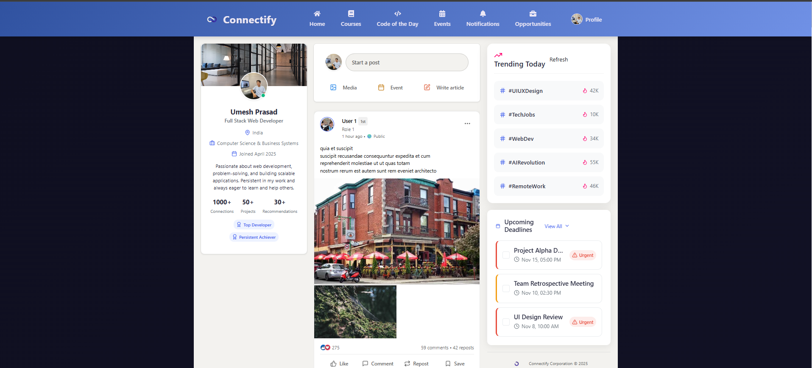
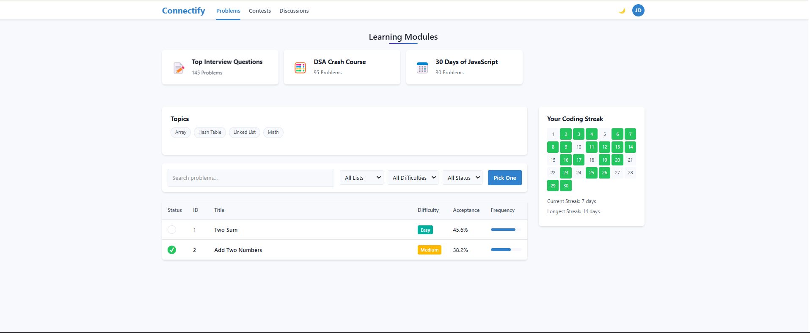
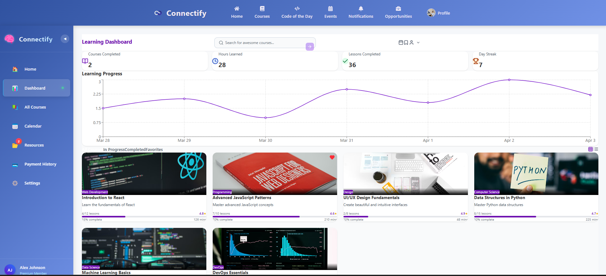

# 🚀 Connectify

**Connectify** is a dynamic and full-featured web platform that connects students with personalized learning resources, coding challenges, course dashboards, calendars, and community engagement tools. Built using the MERN stack and powered by modern animations and sleek UI/UX, Connectify is your one-stop learning companion.

---

## 🔥 Features

### 👨‍🎓 Student Section
- Browse and enroll in curated courses
- Track learning progress with visual charts
- View completed, in-progress, and upcoming modules

### 🧠 Code of the Day
- LeetCode-style coding problems
- Real-time code editor with test case support
- Analytics, difficulty filters, tags, and trending topics

### 📅 Learning Calendar
- Schedule personalized study sessions
- Time & duration input with animated calendar interface
- Integrated with course modules

### 📚 Course Dashboard
- Access purchased or enrolled courses
- Learning rate graph & progress bar
- Responsive layout with minimal Tailwind usage

### 💡 Profile Editor Modal
- Tabbed interface for updating personal details, education, preferences
- Smooth Framer Motion animations
- Light/Dark mode support

### 🔐 Auth System
- Secure signup/login
- Token-based authentication
- Fully integrated with backend APIs

---

## 🛠️ Tech Stack

**Frontend:**
- React.js
- Tailwind CSS
- Framer Motion
- React Router DOM

**Backend:**
- Node.js
- Express.js
- MongoDB

**Others:**
- JWT Authentication
- RESTful APIs
- Modular Component Architecture

---

## 📁 Project Folder Structure

CONNECTIFY ├── Backend │ ├── config │ ├── controllers │ ├── middleware │ ├── models │ ├── node_modules │ └── routes ├── frontend │ ├── node_modules │ ├── public │ └── src ├── .env ├── .gitignore ├── eslint.config.js ├── index.html ├── index.js ├── package-lock.json ├── package.json ├── README.md └── vite.config.js

---

## 📂 Frontend `src/` Structure

src/ ├── components/ │ ├── CourseDashboard/ │ ├── CourseModal/ │ ├── LearningCalendar/ │ ├── CodeOfTheDay/ │ └── ... ├── pages/ │ ├── Home.jsx │ ├── Courses.jsx │ └── ... ├── routes/ ├── assets/ ├── styles/ ├── utils/ ├── App.jsx └── main.jsx

## Screenshots

Here are some screenshots of the Connectify application:

## Screenshots

Here are some screenshots of the Connectify application:

### Login Page

### Landing Page

### Home Page

### Course Section

### Code Editor

### Dashboard

